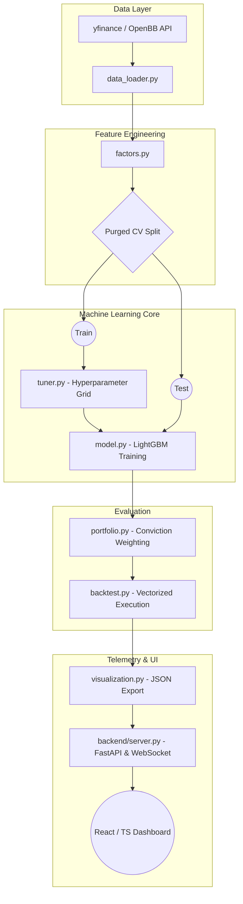

<div align="center">
  <h1>AlphaEngine</h1>
  <h3>Machine Learning Driven Quantitative Trading Pipeline</h3>
  <br />
  
  [](https://www.python.org/)
  [](https://fastapi.tiangolo.com)
  [](https://react.dev/)
  [](https://lightgbm.readthedocs.io/en/latest/)
  [](#)
</div>

<br/>

AlphaEngine is an institutional-quality quantitative trading pipeline and real-time telemetry dashboard designed specifically for the Indian Equity market (Nifty 50 universe). 

This project demonstrates a rigorous, end-to-end systematic trading architecture: bridging raw market data ingestion, dynamic feature engineering (Alpha generation), strict Purged Time-Series Cross-Validation natively designed for financial modeling, and robust vectorized backtesting. The backbone ML engine trains gradient-boosted decision trees (`LightGBM`) integrated with a decoupled `FastAPI` + `React/TypeScript` monitoring visualizer.

## 🎯 The Problem It Solves

Retail trading strategies often fail in live markets due to **data leakage, survivorship bias, and curve fitting**. Standard backtests typically ignore transaction costs and assume instantaneous execution. 

AlphaEngine solves this by:
*   **Preventing Leakage**: Using Purged Time-Series Cross-Validation to ensure the model never learns from future overlapping data.
*   **Realistic Simulation**: Delivering vectorized backtests that factor in transaction costs (slippage/commissions).
*   **Dynamic Risk Management**: Sizing positions based on conviction/volatility rather than fixed allocations, mirroring institutional practices.

## 🚀 Key Architectural Features

*   **Alpha Factor Engineering**: Calculates complex technical momentum and volatility series (MACD overlays, RSI divergence, Bollinger Band widths, Volume Shocks).
*   **Leakage-Proof Machine Learning**: Implements strict Purged Time-Series Cross-Validation to ensure the `LightGBM` core model evaluates hold-out data accurately, avoiding the fatal data leakage commonly found in retail financial models.
*   **Conviction-Weighted Sizing**: Transforms prediction confidence into continuous position sizing bounds using risk-adjusted allocations (inspired by the Kelly Criterion).
*   **Vectorized Backtesting Engine**: Executes instantaneous backtests analyzing portfolio drift, calculating exact transaction cost drags, and outputting standard institutional risk metrics (Sharpe, Calmar, Max Drawdown, CVaR).
*   **Real-time Decoupled Dashboard**: The entire Python pipeline automatically orchestrates a background `FastAPI` instance with `WebSockets`, streaming the locally exported backtest JSON payloads directly to a stunning `Vite+React` monitoring interface.

---

## 📊 Example Backtest Output

The engine automatically computes key institutional metrics at the end of the run. Here is an example performance summary you'll see on the console and dashboard:

| Metric | Value |
| :--- | :--- |
| **Annualized Return** | 24.5% |
| **Sharpe Ratio** | 1.82 |
| **Max Drawdown** | -12.4% |
| **Sortino Ratio** | 2.15 |
| **Win Rate** | 56.8% |

*(Interactive visualizations, feature importance (SHAP), and live equity curves are available directly in the React Dashboard).*

---

## 🧠 System Architecture



---

## 📂 Repository Structure

```text
AlphaEngine/
├── backend/
│   ├── server.py              # FastAPI server handling WebSocket feeds & REST APIs
│   └── openbb_service.py      # Async market data retrieval and fallback management
├── dashboard/                 # Vite + React (TypeScript) live dashboard UI (Port 5173)
├── main.py                    # Master orchestrator spawning the inference nodes and UI
├── config.py                  # Global hyperparameters, Nifty 50 Universe, Horizons
├── data_loader.py           # Ingests and scrubs daily Close/Volume data matrices
├── factors.py                 # Multi-factor Alpha generation and forward-return targeting
├── cross_validation.py        # Institutional Purged Combinatorial CV generator
├── tuner.py                   # Automated grid-searching for LGBM tree optimization 
├── model.py                   # Model inference pipelines (with SHAP integrations)
├── portfolio.py               # Volatility-targeted and scaled position sizing
└── backtest.py                # Heavyweight vectorized metrics calculation 
```

---

## ⚙️ Installation & Usage

### 1. Prerequisites
*   **Python 3.10+**: Crucial for running the backend machine learning and backtesting pipelines. ([Download Python](https://www.python.org/downloads/))
*   **Node.js (v18+) & npm**: Required to run the React/Vite live dashboard. ([Download Node.js](https://nodejs.org/))
*   **Git**: To clone the repository.

### 2. Installation Steps
```bash
# Clone the repository
git clone https://github.com/your-username/AlphaEngine.git
cd AlphaEngine

# Install core Python dependencies (LightGBM, Pandas, FastAPI, etc.)
pip install -r requirements.txt

# Install frontend Javascript dependencies
cd dashboard
npm install
cd ..
```

### 3. How to Run the Pipeline & Dashboard
To execute the pipeline and launch the live telemetry UI, simply run:
```bash
# Start the full engine (Backtest + FastAPI Server + Dashboard)
python main.py
```

> **What this does:**
> 1. **Model Training & Backtesting**: Scrapes data, calculates alphas, trains LightGBM, and simulates the trading strategy.
> 2. **JSON Export**: Writes the backtest metrics and signals to a JSON payload in `/dashboard/public` for the frontend.
> 3. **Backend Server**: Internally deploys the FastAPI server to handle data streaming.
> 4. **Live Dashboard**: Automatically spins up the React dashboard and opens your default web browser to `http://localhost:5173` to view the live dashboard.

If you ever need to manually start *just* the dashboard without re-running the ML pipeline:
```bash
cd dashboard
npm run dev
``` 

---

## 🤝 Contributing
Contributions, issues, and feature requests are welcome! If you'd like to contribute, please check out our [Contributing Guide](CONTRIBUTING.md).

## 📄 License
This project is [MIT](LICENSE) licensed.

---

> **Disclaimer:** *This software is for educational, research, and portfolio demonstration purposes only. Automated algorithmic trading carries substantial financial risk. The metrics produced by this pipeline simulate un-slippaged historically vectorized approximations and do not constitute real-world financial advice.*
