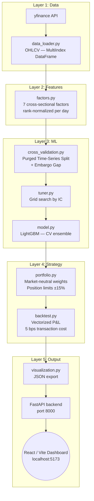

<div align="center">
  <h1>Alpha Engine</h1>
  <h3>Machine Learning Driven Quantitative Trading Research Pipeline</h3>
  <br />

  [](https://www.python.org/)
  [](https://fastapi.tiangolo.com)
  [](https://react.dev/)
  [](https://lightgbm.readthedocs.io/en/latest/)
  [](#)
</div>

<br />

---

## Documentation

| Document | Who it is for | Reading time |
|---|---|---|
| [README_SHORT.md](README_SHORT.md) | Recruiters — quick overview of what this is | ~35 seconds |
| [README_DETAILED.md](README_DETAILED.md) | Engineers, quants, interviewers — full technical breakdown | ~5–7 minutes |

> **Start with `README_SHORT.md`. If you want the technical detail, move to `README_DETAILED.md`.**

---

## What This Is

A Python research pipeline for systematic signal generation and backtesting on Indian equities (Nifty 50). The pipeline covers the full quantitative research loop: data ingestion, feature engineering, machine learning, portfolio construction, backtesting, and result visualization.

**This is a research and learning project. It is not a live trading system.**

---

## Pipeline



---

## Features (as implemented)

- **Data:** ~40 Nifty 50 stocks, 2015–2024, sourced from Yahoo Finance
- **Factors:** Momentum (1m, 3m, 6m), short-term reversal, 20-day volatility, volume shock, intraday high-low range — all cross-sectionally rank-normalized
- **Model:** LightGBM regressing on 5-day forward returns, ensemble-averaged across CV folds
- **CV:** Purged walk-forward time-series split with 2% embargo gap to prevent label leakage
- **Tuning:** Grid search over depth, leaves, and learning rate; selected by mean daily Information Coefficient (IC)
- **Portfolio:** Demeaned signal converted to long/short weights, capped at ±15%, gross leverage ≤ 1.0
- **Backtest:** Daily vectorized P&L, 5 bps transaction cost per unit of weight turnover
- **Metrics:** Annualized return, volatility, Sharpe, max drawdown, Calmar, avg daily turnover
- **Dashboard:** FastAPI backend + Vite/React frontend, launched automatically after the pipeline run

---

## Quick Start

```bash
# 1. Set up Python environment
python -m venv .venv
.venv\Scripts\activate        # Windows
# source .venv/bin/activate   # macOS / Linux
pip install -r requirements.txt

# 2. Install dashboard dependencies
cd dashboard
npm install
cd ..

# 3. Run the full pipeline
python main.py
```

The pipeline fetches data, trains the model, runs the backtest, and opens the dashboard
at `http://localhost:5173` automatically. Press `Ctrl+C` to stop.

---

## Repository Structure

```
AlphaEngine/
├── config.py             # Universe, dates, model params, risk limits
├── data_loader.py        # yfinance download → MultiIndex DataFrame
├── factors.py            # 7 cross-sectional factors + forward return target
├── cross_validation.py   # Purged time-series CV with embargo
├── tuner.py              # Grid search scored by Information Coefficient
├── model.py              # LightGBM training + CV ensemble prediction
├── portfolio.py          # Market-neutral weight construction
├── backtest.py           # Vectorized backtest + metrics
├── visualization.py      # JSON export for dashboard, HTML tearsheet
├── main.py               # Orchestrator — runs pipeline, starts servers
├── backend/              # FastAPI server serving dashboard data
└── dashboard/            # Vite + React frontend
```

---

## Limitations

- Data from Yahoo Finance only — survivorship bias is present (no delisted stocks)
- Not tested out-of-sample — the backtest covers the same period as model development
- No slippage, market impact, or short borrow costs modeled
- Single model class (LightGBM); no baseline comparison implemented

---

## License

[MIT](LICENSE)

---

> This project is for research and educational purposes only. Results are simulated historical approximations and do not constitute financial advice.
