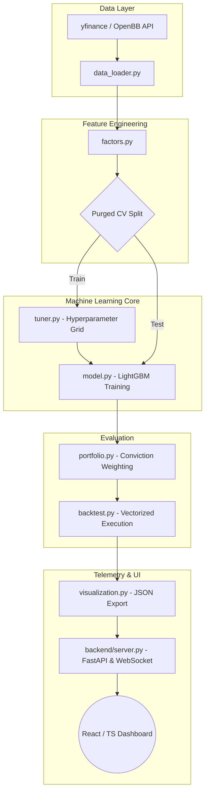

<div align="center">
  <h1>AlphaEngine</h1>
  <h3>Machine Learning Driven Quantitative Trading Pipeline</h3>
  <br />
  
  [](https://www.python.org/)
  [](https://fastapi.tiangolo.com)
  [](https://react.dev/)
  [](https://lightgbm.readthedocs.io/en/latest/)
  [](#)
</div>

<br/>

AlphaEngine is an institutional-quality quantitative trading pipeline and real-time telemetry dashboard designed specifically for the Indian Equity market (Nifty 50 universe). 

This project demonstrates a rigorous, end-to-end systematic trading architecture: bridging raw market data ingestion, dynamic feature engineering (Alpha generation), strict Purged Time-Series Cross-Validation natively designed for financial modeling, and robust vectorized backtesting. The backbone ML engine trains gradient-boosted decision trees (`LightGBM`) integrated with a decoupled `FastAPI` + `React/TypeScript` monitoring visualizer.

## 🚀 Key Architectural Features

*   **Alpha Factor Engineering**: Calculates complex technical momentum and volatility series (MACD overlays, RSI divergence, Bollinger Band widths, Volume Shocks).
*   **Leakage-Proof Machine Learning**: Implements strict Purged Time-Series Cross-Validation to ensure the `LightGBM` core model evaluates hold-out data accurately, avoiding the fatal data leakage commonly found in retail financial models.
*   **Conviction-Weighted Sizing**: Transforms prediction confidence into continuous position sizing bounds using risk-adjusted allocations (inspired by the Kelly Criterion).
*   **Vectorized Backtesting Engine**: Executes instantaneous backtests analyzing portfolio drift, calculating exact transaction cost drags, and outputting standard institutional risk metrics (Sharpe, Calmar, Max Drawdown, CVaR).
*   **Real-time Decoupled Dashboard**: The entire Python pipeline automatically orchestrates a background `FastAPI` instance with `WebSockets`, streaming the locally exported backtest JSON payloads directly to a stunning `Vite+React` monitoring interface.

---

## 🧠 System Architecture



---

## 📂 Repository Structure

```text
AlphaEngine/
├── backend/
│   ├── server.py              # FastAPI server handling WebSocket feeds & REST APIs
│   └── openbb_service.py      # Async market data retrieval and fallback management
├── dashboard/                 # Vite + React (TypeScript) live dashboard UI (Port 5173)
├── main.py                    # Master orchestrator spawning the inference nodes and UI
├── config.py                  # Global hyperparameters, Nifty 50 Universe, Horizons
├── data_loader.py           # Ingests and scrubs daily Close/Volume data matrices
├── factors.py                 # Multi-factor Alpha generation and forward-return targeting
├── cross_validation.py        # Institutional Purged Combinatorial CV generator
├── tuner.py                   # Automated grid-searching for LGBM tree optimization 
├── model.py                   # Model inference pipelines (with SHAP integrations)
├── portfolio.py               # Volatility-targeted and scaled position sizing
└── backtest.py                # Heavyweight vectorized metrics calculation 
```

---

## ⚙️ Installation & Usage

### 1. Prerequisites
You will need **Python 3.10+** and **Node.js (v18+)** installed to build the React dashboard locally.

### 2. Environment Setup
```bash
# Clone the repository
git clone https://github.com/your-username/AlphaEngine.git
cd AlphaEngine

# Install core Python dependencies (LightGBM, Pandas, FastAPI, etc.)
pip install -r requirements.txt

# Install frontend Javascript dependencies
cd dashboard
npm install
cd ..
```

### 3. Run the complete pipeline
```bash
python main.py
```
> **What this does:**
> The master script handles the entire flow. It trains the model locally, calculates the risk metrics of the backtest, writes the results into a lightweight JSON payload mapped to `/dashboard/public`, internally deploys the FastAPI telemetry server, and spins up your browser automatically pointing to `http://localhost:5173`. 

---

## 📚 Study Curriculum

This pipeline was developed in tandem with a rigorous **30-Day Quantitative Engineering Study Plan**, mapping directly to literature found in *Advances in Financial Machine Learning (Marcos Lopez de Prado)* and *Machine Learning for Algorithmic Trading (Stefan Jansen)*.

Please refer to `Quant_Curriculum.pdf` located in the root directory for a daily breakdown of the theoretical mathematics governing the Python files here.

---

> **Disclaimer:** *This software is for educational, research, and portfolio demonstration purposes only. Automated algorithmic trading carries substantial financial risk. The metrics produced by this pipeline simulate un-slippaged historically vectorized approximations and do not constitute real-world financial advice.*
